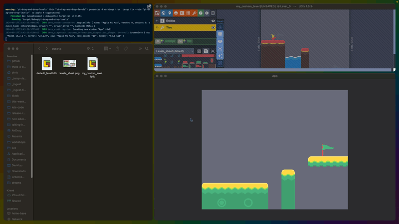

## Drag and Drop LDtk levels

This demo showcases Bevy's built-in Drag-and-Drop functionality, powered by `Event`s.

It uses a 0.13 version of [`bevy_ecs_ldtk`](https://github.com/Trouv/bevy_ecs_ldtk) to power LDtk loading.

